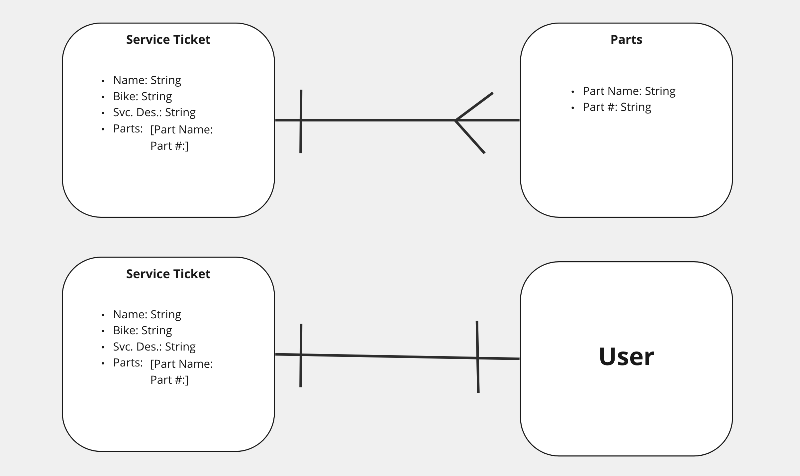

# Bike Shop Service Manager #

## Description: ##

An app for bike shop employees to create service tickets to track their service queue.  They can update and delete, as well as attach parts/part numbers to each ticket.  The app is user centric, and requires a login to access the active tickets, and you can only update or delete tickets that you created.

### Technologies Used: ###
-HTML

-JavaScript

-CSS

-Express

-Mongoose

-Json Web Token

-MongoDb

## Entity Relationship Diagram (ERD): ##

## Getting Started: ##
You can visit the page at this link: (Bike Shop Service Manager)

## Routes Table: ##

| Name        | Path                             |HTTP Verb    |Purpose             |
| ----------- | -------------------------------- | ----------- | ------------------ |
| Index       | /tickets/                        |GET          |Displays all tickets|
| Create      | /tickets/                        |POST         |Creates new ticket  |
| Show        | /tickets/:ticketId               |GET          |Displays one ticket |
| Update      | /tickets/:ticketId               |PATCH        |Upates one ticket   |
| Delete      | /tickets/:ticketId               |DELETE       |Deletes one ticket  |
| Create      | /tickets/:ticketId/parts/        |POST         |Creates new part    |
| Delete      | /tickets/:ticketId/parts/:partID |DELETE       |deletes one  part   |
| SignUp      | /sign-up                         |POST         |Creates new login   |
| SignIn      | /sign-in                         |POST         |Logs user in        |

